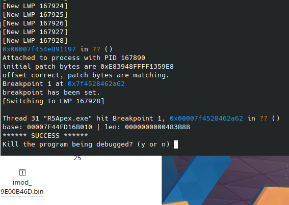
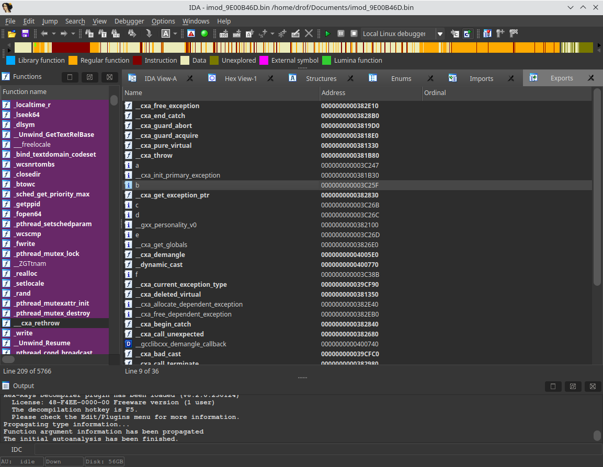

# Intro
For the people already having past experience with researching EAC on Windows, they will remember their internal module residing in the game process. Whilst on Windows this is mapped by `EasyAntiCheat.sys` kernel driver, on linux it's being done by `easyanticheat_x64.so`, which is a user-mode shared library also running in the game process.
This project consists of a small python script which you'll need to load into gdb, that will obtain said module with ELF-Headers intact.

# Showcase



# Usage
```
git clone https://github.com/cryotb/leac-imod-dumper
<edit the hardcoded imod path>
execute with root permission: `gdb --command leim-dumper.py`
<start game>
<follow the instructions displayed by gdb and the script.>
```

If no mistakes were made, script will save the payload in your modified path like this: `imod_<CRC32_VALUE>.bin`.

# How it works
In order to understand how this works, you'll need to take a look inside `easyanticheat_x64.so`like this:
```
void* c_eac_launcher::load_shlib_from_mem(void *buf, size_t len, const char **path_ptr)
{
  lib_handle = 0LL;
  is_args_invalid = len == 0 || buf == 0LL;
  if ( !is_args_invalid )
  {
    generate_random_uuid_str(fd_name);
    fd_name[30] = 0;                            // null terminate
    fd = syscall(319LL, fd_name, 3LL);          // SYSCALL 'sys_memfd_create'
    if ( fd < 0 )
    {
      is_args_invalid = 1;
      fd = shm_open(fd_name, 194, 0x1C0u);
      if ( fd < 0 )
        return c_eac_launcher::load_shlib_from_file_instead(buf, len, path_ptr);
    }
    lib_handle = 0LL;
    if ( write(fd, buf, len) == len ) // <----- #BP HERE
    {
      fcntl(fd, 1033, 15LL);
      snprintf(fd_path, 0x100uLL, "/proc/self/fd/%i", (unsigned int)fd);
      lib_handle = dlopen(fd_path, 1);
    }
    close(fd);
    if ( is_args_invalid )
      shm_unlink(fd_name);
    if ( !lib_handle )
      return c_eac_launcher::load_shlib_from_file_instead(buf, len, path_ptr);
  }
  return lib_handle;
}
```
Above function is responsible for some parts of the loading procedure. All we are doing is setting a breakpoint at it's call to `write`, reading the register state to get payload base and length, and then saving it on disk.

# Caveats
- Because we are attaching GDB to the game process, you should either be offline or use an alt account.
- The offset to the `write` call has been hardcoded due to laziness, you can easily automate this with signature scanning and some auto disassembly.
- There are better methods of doing this, for example see how it utilizes file descriptors, but that's for another day.

# Conclusion
You now have your hands on the internal game module component of EasyAntiCheat. Just like on windows, it handles Cerberus stuff, Game Interfaces, and such. Keep in mind that it's in ELF format, not PE, and it's moderately obfuscated so good luck!
